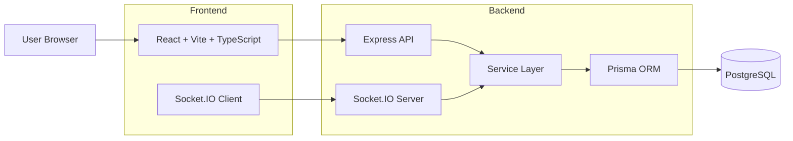
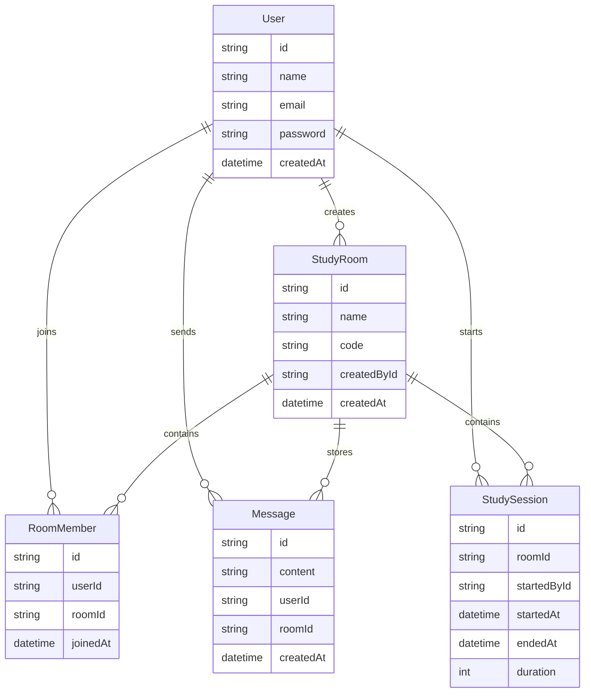
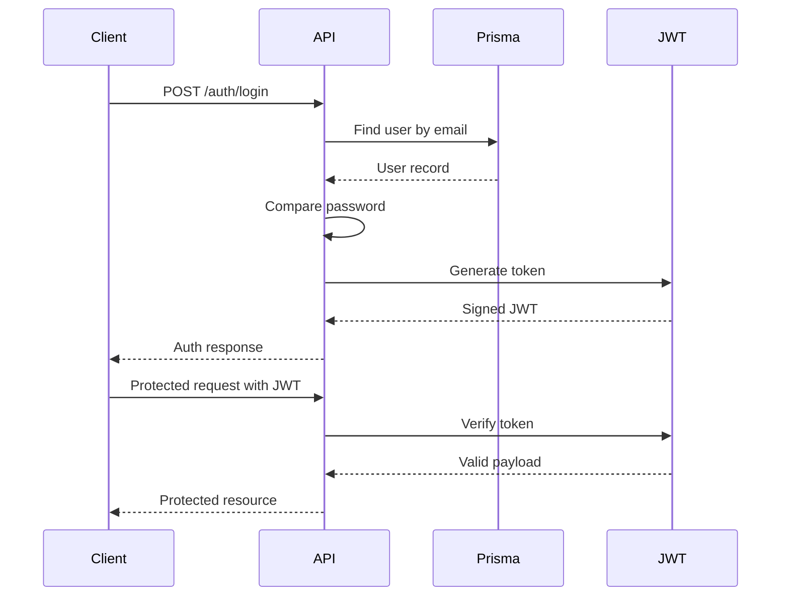
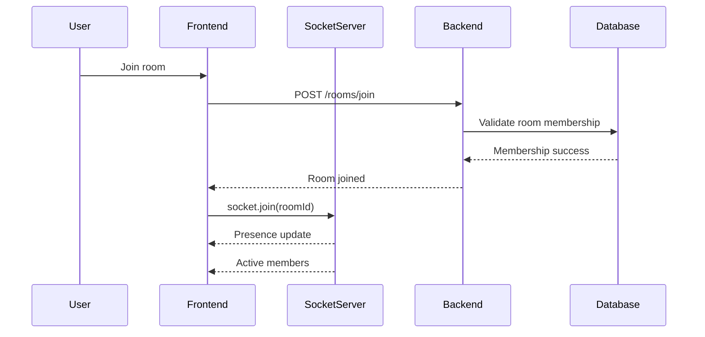
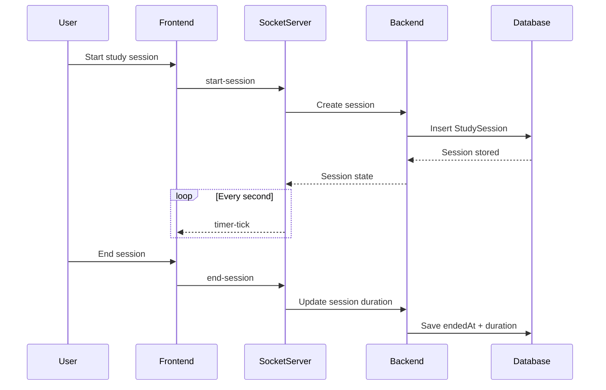
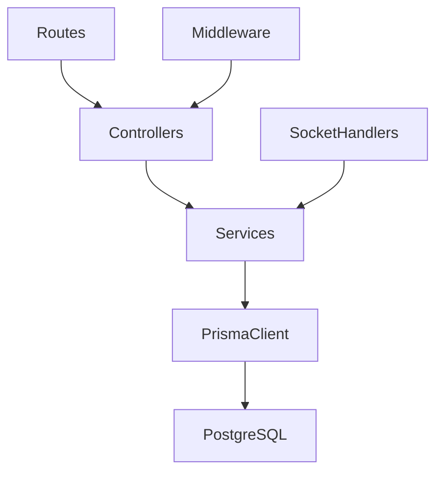
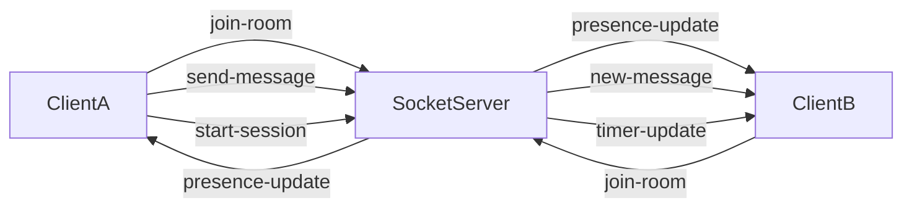
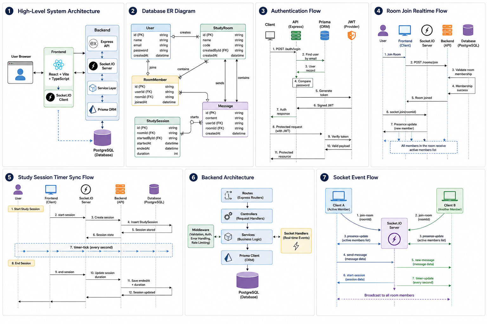

# System Diagrams

This document contains the core architecture and interaction diagrams for the Collaborative Study Room Platform.

---

# 1. High-Level System Architecture

---

# 2. Database ER Diagram

---

# 3. Authentication Flow

---

# 4. Room Join Realtime Flow

---

# 5. Study Session Timer Sync

---

# 6. Backend Architecture

---

# 7. Socket Event Flow

---

# Notes

The architecture intentionally prioritizes:

* clean separation of concerns,
* maintainability,
* predictable realtime synchronization,
* and incremental scalability improvements.

The current implementation is optimized for moderate-scale realtime collaboration workloads while remaining simple enough for rapid iteration and deployment on lightweight infrastructure.

>### UML

